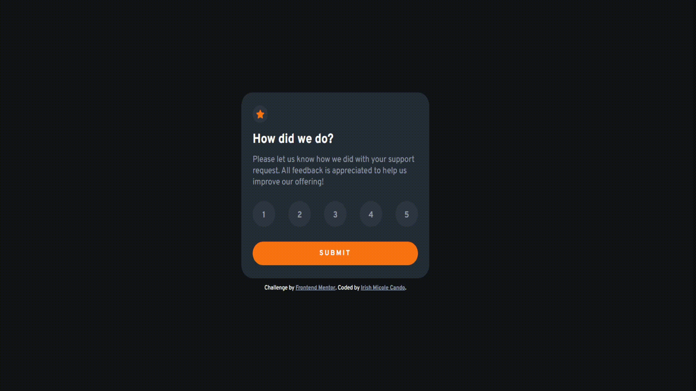

# Interactive Rating Component Solution

This is a solution to the [Interactive rating component challenge](https://www.frontendmentor.io/challenges/interactive-rating-component-koxpeBUmI) on Frontend Mentor.

## Solution

### The challenge
Users should be able to:

- View the optimal layout for the app depending on their device's screen size
- See hover states for all interactive elements on the page
- Select and submit a number rating
- See the "Thank you" card state after submitting a rating

### Design Templates
**Desktop View**

**Mobile View**

### Links

- Solution URL: [GitHub](https://github.com/irishmicoletcando/interactive-rating-component)
- Live Site URL: [Interactive Rating Component Demo](https://interactive-rating-component-five-sigma.vercel.app/)

### Built with

- Semantic HTML5 markup
- CSS3
- Flexbox
- Mobile-first workflow
- Vanilla JavaScript

### Author

- Frontend Mentor - [@irishmicoletcando](https://www.frontendmentor.io/profile/irishmicoletcando)
